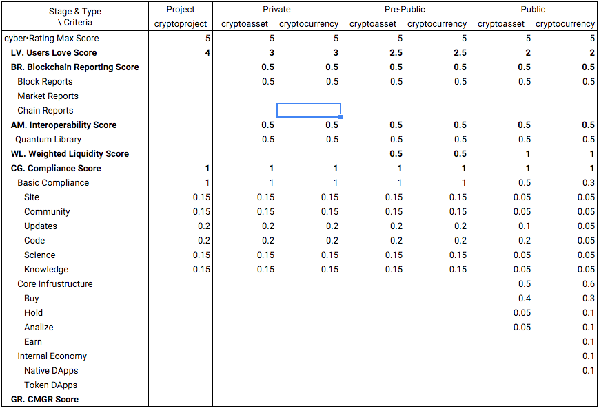
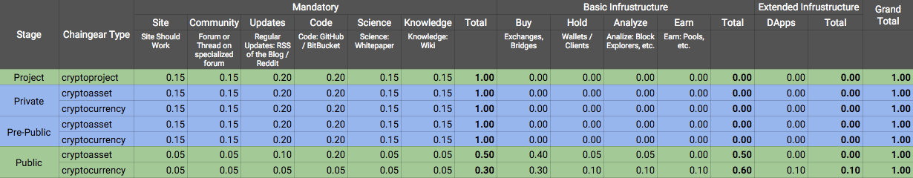

# Scoring Coefficients

Scoring coefficients depend on a stage of development and associated chaingear type. Full overview:


## Chaingear

Scoring coefficients depend on a stage of development and associated chaingear type:


Scores are awarded for the existence of links of the appropriate type in the [ChainGear](https://github.com/cyberFund/chaingear) repository


*Site scoring*:

Awarded for the existence of a working official website.
- `0.15` score. For System at `Project`, `Private`, `Pre-Public` stage of development
- `0.05` score. For System at `Public` stage of development

*Community scoring*:

Awarded for the existence of a Forum or Thread on specialized forum (like bitcointalk.org)
- `0.20` score. For System at `Project`, `Private`, `Pre-Public` stage of development
- `0.10` score. For `cryptoasset` at `Public` stage of development
- `0.05` score. For `cryptocurrency` at `Public` stage of development

*Updates scoring*:

Awarded for the existence of regular updates about project (RSS from the Blog / Reddit / tagged Media)
- `0.20` score. For System at `Project`, `Private`, `Pre-Public` stage of development
- `0.10` score. For `cryptoasset` at `Public` stage of development
- `0.05` score. For `cryptocurrency` at `Public` stage of development

*Code scoring*:

Awarded for the existence of a repository at GitHub or BitBucket.
- `0.20` score. For System at `Project`, `Private`, `Pre-Public` stage of development
- `0.20` score. For `cryptoasset` at `Public` stage of development
- `0.05` score. For `cryptocurrency` at `Public` stage of development

*Science scoring*:

Awarded for the existence of a whitepaper.
- `0.15` score. For System at `Project`, `Private`, `Pre-Public` stage of development
- `0.05` score. For System at `Public` stage of development

*Knowledge scoring*:

Awarded for the existence of a wiki.
- `0.15` score. For System at `Project`, `Private`, `Pre-Public` stage of development
- `0.05` score. For System at `Public` stage of development

*Buy/Sell ability scoring*:

Awarded for presence on the stock exchanges.
`cryptoassets`:
- `0.08` score. 1 exchange
- `0.16` score. 2-3 exchanges
- `0.24` score. 3-5 exchanges
- `0.32` score. 6-9 exchanges
- `0.40` score. 10+ exchanges

`cryptocurrencies`:
- `0.06` score. 1 exchange
- `0.12` score. 2-3 exchanges
- `0.18` score. 3-5 exchanges
- `0.24` score. 6-9 exchanges
- `0.30` score. 10+ exchanges

*Hold scoring*:

Awarded for ability to operate of tokens with a different wallets.
`cryptoassets`:
- `0.02` score. 1 wallet
- `0.04` score. 2-3 wallets
- `0.06` score. 3-5 wallets
- `0.08` score. 6-9 wallets
- `0.10` score. 10+ wallets

`cryptocurrencies`:
- `0.01` score. 1 wallet
- `0.02` score. 2-3 wallets
- `0.03` score. 3-5 wallets
- `0.04` score. 6-9 wallets
- `0.05` score. 10+ wallets

*Analyze scoring*:

Awarded for the existence of a blockchain explorers.
`cryptoassets`:
- `0.02` score. 1 block explorer
- `0.04` score. 2-3 block explorers
- `0.06` score. 3-5 block explorers
- `0.08` score. 6-9 block explorers
- `0.10` score. 10+ block explorers

`cryptocurrencies`:
- `0.01` score. 1 block explorer
- `0.02` score. 2-3 block explorers
- `0.03` score. 3-5 block explorers
- `0.04` score. 6-9 block explorers
- `0.05` score. 10+ block explorers

*Earn scoring*:

Awarded for presence at the mining pools or other sources which allows to earn tokens (score availible only for `cryptocurrencies`).
- `0.02` score. 1 mining pool
- `0.04` score. 2-3 mining pools
- `0.06` score. 3-5 mining pools
- `0.08` score. 6-9 mining pools
- `0.10` score. 10+ mining pools

*DApps score*:

Awarded for the existence of a DApps builded on the top of a system  
- `0.1` score

## Blockchain Reporting

In development

## Interoperability

Ease of integration is evaluated. At this point of time we evaluate only integration with library that allow crosschain update of balances (trusted). In a future we are going to extend it with emerging libs.

Scoring:
- 0.5 score. If integration with [Quantum library](https://github.com/cyberFund/quantum) is `true`

## Weighted Liquidity

Daily turnover grade is evaluated against market cap grade.

Turnover scoring:
- `0` score. `Illiquid` grade if daily turnover is 0%
- `0.1` score. `Very Low` grade if daily turnover is <= 0.01%
- `0.2` score. `Low` grade if daily turnover is >0.01% and <= 0.1%
- `0.3` score. `Normal` grade if daily turnover is >0.1% and <= 0.5%
- `0.4` score. `High` grade if daily turnover is >0.5% and <= 2%
- `0.5` score. `Very High` grade if daily turnover is >2%

Cap scoring:
- `0` score. `Pico` grade if cap is <= $10k
- `0.1` score. `Nano` grade if cap is <= $100k
- `0.2` score. `Micro` grade if cap is <= $1M
- `0.3` score. `Kilo` grade if cap is <= $10M
- `0.4` score. `Mega` grade if cap is <= $1B
- `0.5` score. `Giga` grade if cap is > $1B

Calculation example:
```
Daily trade volume of bitcoins is `100000`

USD/BTC price is `$300`

Total Supply is `15000000`

Cap is `300 * 15000000` = `$4.5B`

Cap Grade is `Giga` and score is `0.5`
Daily turnover is `100000 * 300 / 4.5B` = `~0.67%`
Turnover grade is `High` and score is `0.4`
```

## People's Love

At this point of time we use simple centralized metrics to calculate people's love. cyber•Fund have a mechanism of starring systems that allow simplified evaluation. Eventually we want to develop rating system that don't rely on centralized third parties, but now there is no better alternative exist.

Scoring:
To calculate a score we use a ratio between quantity of stars of system we evaluate and quantity of stars of the most starred system. For the most starred system a score is always max.

Calculation example:
We want to calculate a rating of Ethereum. Bitcoin is the most starred system with 50 stars. Ethereum has 40 stars. Ethereum is in `Public` stage thus max score for Love is 2.
`40 / 50 * 2` = `1.6`
So Ethereum will have a love score of 1.6
