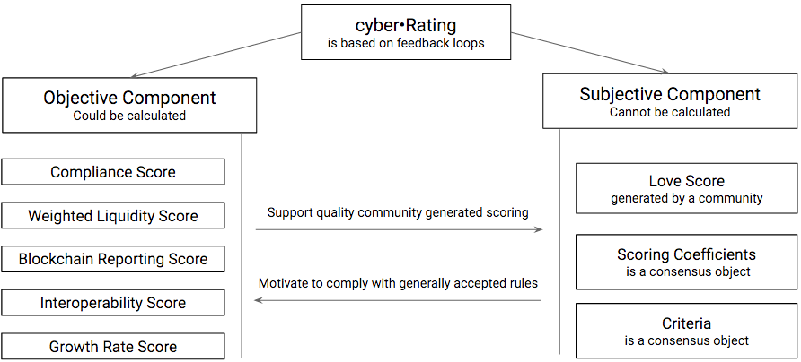
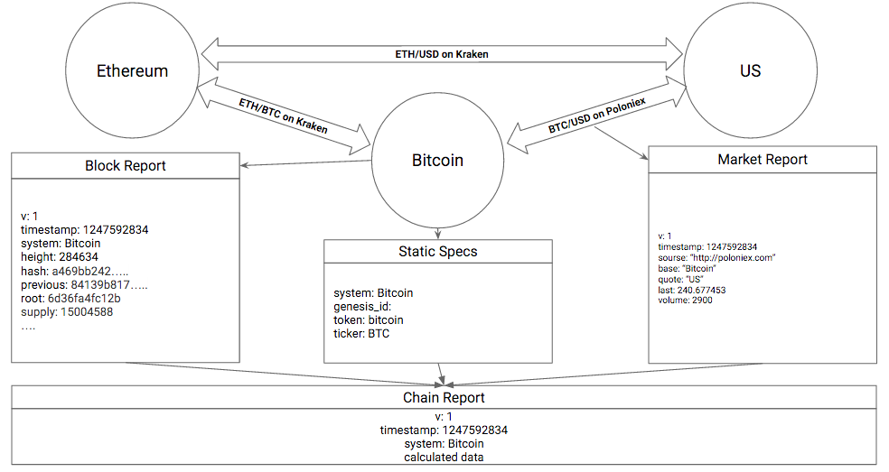

# cyber•Rating: Cryptoproperty Evaluation

Version 0.0.1. Initial Draft

Dima Starodubcev, [@21xhipster](https://keybase.io/21xhipster), [cyber•Fund](https://cyber.fund)

Abstract. Cryptoproperty is one of the most rapidly growing class of economic values nowadays. There are several protocols that determine working principles of the cryptocurrencies as well as several protocols that enable creation and accounting of cryptoassets. Due to unique value proposition explosive growth of cryptoproperty is inevitable. The new emerging class of economic values and corresponding economic system have early stage problems that make investors to suffer such as: (a) lack of clear definitions of basic terms, (b) weak understanding of the value proposition, (c) lack of understanding of how to assess risks. The widely-used credit-rating methodologies such as S&P, Fitch, Moody's which are based on IFRS and GAAP (corporate) and scattered reports (soverign) are not applicable to the cryptoproperty and thus can't solve above mentioned issues. This paper defines some basic terms for cryptoproperty, outlines basic approach to their risk assessment and proposes a solution for evaluation of the cryptoproperty without necessity for expensive audit procedures in a truly decentralized way.

## 1. Introduction

Today at least 20 cryptoassets are created every day using only NXT, Counterparty, Open Assets, Colored Coins, and Ethereum. At least 5 new cryptocurrencies are announced every day on Bitcointalk [24].

Though on the market exist plenty of solutions ([25], [26], [27], [28]), trying to solve problems of cryptoproperty evaluation it doesn't seems that any of them successfully achieve this goal as none of them providing the data critical for investment decision: methodology of cap calculation, transactional analytics and health of networks, adoption by people's, user generated ranking system sustainable for sybil attacks and simple to comprehend compliance approach.

Problems of using traditional methodologies such as S&P, Fitch and Moody's applied to cryptoproperty:

1. Are based on reporting systems such as IFRS and GAAP that could not be applied for blockchain based systems.
2. Are debt based. Existing decentralized entities designed to rely on intrinsic value of underlying token rather than on system's debt. Though some of existing methodologies could be applied for some centralized classes of cryptoassets.
3. Focus on creditworthiness and don't care about growth capabilities that are so important in existing investment landscape.
4. Don't distinguish unique permissionless nature of cryptoproperty and permissioned state-based property.
5. Take as assumption power of legacy law, judgment and execution systems and don't care about existence of programmatic law. Existing blockchain entities exist independently of legacy state based systems and don't care about it's existence.
6. Didn't designed to work programmatically.
7. Are managed in centralized way.
8. Are highly subjective.

Mentioned above facts create demand for a new system of reporting that will enable decentralized rating of autonomous systems thus creating positive investment climate for universes of cryptoproperties.

## 2. Approaching Problem of Definitions

Cryptocurrency [10], decentralized system [12], decentralized autonomous organization [7], decentralized application [8], distributed collaborative organization [6], blockchain [11], distributed ledger [13], cryptoasset [9], consensus computer [39]. That is not exhausted list of terms used in the space. Although all these terms are viable they try to reflect some aspect of discussed systems. We propose definitions for cryptoproperty and its subclasses: cryptocurrency of independent system and cryptoasset of dependent system which we believe reflect nature of discussed topic and in some way technology agnostics.

Definitions don't try to achieve legal compliance as author truly believe that (a) it is impossible to achieve for more than 200 legal systems, (b) definitions should serve marketing purpose and need to be consumer friendly for global mainstream adoption and (c) legacy legal systems should fit to natural and math laws and not otherwise.

Cryptoproperty is a property of digital data [31] belonging of which can be proven by digital signature [32] and existence of which can be proven by independent system. Acceptable synonyms: digital tokens or tokens, internal capital.

For independent systems exist 3 simple requirements:

1. Should be established and uniquely identifiable via Genesis ID.
2. Should have underlying internal capital - a cryptocurrency responsible for resilience of network consensus and immunity to double spend attacks.
3. Core code responsible for network consensus should be open source, buildable and executable for at least one open source operating system.

Any system that follow this requirements could be treated as independent system regulated by cryptocurrency. Acceptable synonyms: decentralized autonomous organization/corporation.

These requirements caused by the fact that if this requirements hadn't met you have no ability to prove your ownership rights and existence of cryptoproperty object. Otherwise also works. If this requirements are met you have ability to prove your ownership rights and existence of cryptoproperty object. Cryptoproperty in form of internal capital that is inherent component of independent system could be defined as cryptocurrency.

As independent systems are just decentralized databases any kind of arbitrary data could be written in such a way that is possible to register and transfer any kind of property without any restrictions thus forming universe of dependent systems.

For dependent systems exist 3 simple requirements:

1. Should be registered using Independent System and uniquely identifiable via Genesis ID.
2. Registration protocol should be defined by a code (e.g. protocol markup extension: NXT AE and Monetary System [18], Solidity Standard Library [30]) and/or natural language (protocol specification such as Open Assets protocol [20], AGS [21] or BitAlias [22].
3. Purpose of registration should be described by a code (Solidity smart contracts [17], Ricardian contracts [19]), and/or natural language (e.g. digitally signed shareholders agreement [38], NatSpec [29], etc.].

Cryptoproperty in form of internal capital that is inherent component of dependent system could be defined as cryptoasset. Acceptable synonyms: Decentralized Application, Dapp, cryptoasset, Blockchain Asset.

Cryptoproperty based economic relations form a new generation economic system that breaks limitations of traditional economics. We propose cybernomics definition. That definitions (a) technology agnostics and (b) general, absorbs transdisciplinary approach as cybernetics itself absorbs any science possible. Cybernomics in fact is working implementation of an idea of perfect markets. Synonyms: Crypto Economics, Blockchain Economics, Cybernetic Economic System.

Blockchain and distributed ledger definitions reflect technology part of cryptoproperty implementation.

## 3. Cryptoproperty Value Proposition

There is lack of clarity on value proposition of decentralized systems and its product - cryptoproperty. Hence cryptoproperty has characteristics that legacy state-based systems are fail to obtain:

1. Efficiency: (a) don't taxable without owner intention, (b) don't have transactional limits, (c) transactions don't need settlement and reconciliation, (d) transactions are fast: from 1 seconds to 10 minutes depending on underlying technology, (e) tiny transaction fees, (f) don't need real estate for decentralized network operation, (g) no enforced compliance costs.
2. Transparency: (a) underlying code is fully open source, (b) all operations accounted on a blockchain or consensus ledger since inception and (c) could be accounted forever.
3. Intelligence: (a) programmable and (b) autonomous, so it could exist by itself and (c) secured by math, not physics.
4. True property: (a) possessed by private key holders, (b) couldn't be enforced by counterparty without private key holder agreement and (c) holder could choose from diversity of consensus algorithms independently of citizenship, residence, nation, belief, gender and even matter holder are made.

Given this any type of economic interaction is more efficient in cybernomics than in traditional state-based economy. Cybernetic Economy Report 2015 [14] and 2015H1 [15] contains detailed analytics and cases.

## 4. Cryptoproperty Risk Assessment

We distinguish risks of (1) cryptoproperty in general, (2) cryptocurrency specific, (3) cryptoasset specific and (4) for different subclasses of both currencies and assets could exist their own specific risks. (2), (3) and (4) are out of paper scope and the subject of further research. The following analysis of (1):

Inherent risk. Risk of weaknesses or exploitable breakthroughs in the field of cryptography. Advances in code cracking, or technical advances such as the development of quantum computers, could present risks to public-key cryptography [33] in general. This risk almost impossible to mitigate as the whole internet and existing financial infrastructure are build using the same public-key cryptography principles such as RSA and ECDSA. Recent researches prove quantum resistance of Lattice-based Cryptography [1] combined with  Merkle-Winternitz signatures [2]. Thus cryptography of existing networks could be upgraded to met quantum resistance requirements on demand.

Loss risk. Risk of losing access to cryptoproperty due to loss of private keys. As noted above any ownership of cryptoproperty is possession of corresponding private keys. Private keys are usually stored in simple files and could be encrypted. In this case there is a risk of losing a password from encrypted private keys alongside with loosing a private key itself. This risk could be mitigated using password managers, specialized hardware wallets, multisig wallets, time-locked wallets, programmatic wills and dzen brain exercises that allow owners to not forget or lose information that is impossible to restore. Regardless of dzen in order to get sure at least one password that allow to decrypt another data should be stored in the cryptoproperty owner’s brain and never should be written, pronounced, shown or recorded. Author acknowledges that at the moment of writing there are no software solutions that are (1) robust, (2) open source, (3) usable (4) functional and (5) programmatically bequeathable. Dashlane doesn’t meet (1) and (2), LastPass, 1Password doesn’t meet (1), (2), and (5),  Encryptr and Keepass doesn’t meet (1), (3) and (5). In any cases web services usage need to be extended with 2 factor auth software such as Authy, Duo or Google Auth that make all existing password solutions not functional enough (4). Thus this risk remains the most critical for cryptoproperty owners and could be mitigated only by educational methods until software/hardware solutions will not be delivered by market forces.

Theft risk. Risk of cryptoproperty theft. Hackers or intelligent agencies may have successful attempt to steal cryptoproperty in 3 cases: (a) weak brainwallet [35] is in use (b) access to your operation system is gained and (c) hardware and software backdoors implanted on a device[34]. The most dzen approach is to store private keys on computer that (a) never has been connected to the internet and (b) has both open source hardware and software, sign transactions offline and then move signed transaction using physical device to connected computer. At this point in time (2) is almost impossible to achieve as government agencies have a significant impact on proprietary hardware and software companies. This risks remains the most significant risk related to cryptoproperty. Recent hardware developments such as Tezos [3] help successfully mitigate this risk in case of usability and compatibility though.

Regulatory risk. Risk of regulatory action in one or more jurisdictions. Cryptoproperty have been the subject of regulatory scrutiny by various regulatory bodies around the globe. Regulators can't block or prohibit physical access to censorship resistant classes of cryptoproperty but regulatory actions could cause panic selling event followed by significant loss of value relatively to fiat currencies. This risk could be mitigated by hedging some portfolio equity using cryptoassets pegged to fiat currencies or commodities such as gold.

Miscomprehension risk. Different digital currencies and assets could have very different set of properties. For instance, Ripple is not censorship resistant, but Bitcoin is. Ripple transactions are final, but Bitcoin transactions need at least 6 network conformations to get high grade of assurance. Some classes of cryptoassets are not decentralized and have issuer risks despite the cryptoproperty itself is secured by underlying independent system.

  To mitigating risk of miscomprehension cyber•Rating methodology is continuously under cyber•Fund development alongside with cyber•Fund real-time analytic service and verified blockchain metadata library Chaingear [31].

## 5. Evaluating Approach

Risks and growth capabilities of cryptoproperty based systems are defined by the following criteria: consensus fault tolerance, CAP theorem balance, cost efficiency, transactional performance, network scalability, decentralization grade, anonymity, strength of cryptography, censorship resistance, self governance, computation capabilities, wealth distribution, storage capabilities, operational transparency, implementation quality, incentive structure, distribution algorithm/approach, monetary policy and consensus dependency.

This criteria should be evaluated against declared market purpose of a system and intrinsic fault tolerance requirements. Though this list could not be exhausted we state it sufficiently comprehensive for the purpose of early evaluation.

These components are divided into 3 logical groups:

- Computable albeit being expensive: e.g. wealth distribution
- Computationally intractable: e.g. monetary policy
- Undecidable: e.g. CAP theorem balance

Thus we can state that exhausted and objective valuation is impossible to achieve. In order to solve this we distinguish objective and subjective part of evaluation. Proposed rating is a five star system and include both components with embedded feedback loops between each other.

cyber•Fund's mission is to make digital investments comprehensible, accessible, easy and safe. The logic of an objective part stems from this requirements and initially include 5 evaluated components:

1. Compliance Score. Compound metric reflecting Cryptoproperty Compliance Declaration. Is a set of simple yes/no statements that are necessary for existence and grow of cryptoproperty.
2. Blockchain Reporting Score. Compound metric that show quality of compliance with Decentralized Reporting Standard.
3. Weighted Liquidity Score. Daily turnover grade is evaluated against market cap grade.
4. Interoperability Score. Reflect support for universal blockchain libraries.
5. Growth Rate Score. Score for compound monthly growth rate. Eventually the most important metric that show return on investments. Is not used in proof-of-concept implementation and is a subject to further research.

Subjective part is straightforward and based on on simple metric that reflect how people love a given cryptoproperty. In technological entrepreneurship exist a quote: "Make what people love". So we propose a simple way to define what people love. To solve this we need to propose a system of community generated scoring (=>7) and (=>8) define reporting system to simplify due diligence by a community.

Calculation specification in appendix [Scoring](https://github.com/cyberFund/cyberrating/blob/master/scoring.md) is used for proof-of-concept[37].

To solve a problem of subjective criteria and scoring weights we propose self governance system that enable to define them on a consensus level of a proposed cyber•Fund investment protocol (=>13).

In order to make proposed rating closer to life we should define different score weights for different lifecycle stages and types of cryptoproperty.

## 6. Lifecycle and Types

During lifecycle of a system different criteria are important. We propose to distinguish lifecycle stage of an evaluated systems. Every stage should have different score weights. Observing how decentralized systems has been born we can formulate the following lifecycle stages: Project, Private, Pre-public and Public:

- Project stage is a code or a paper that don't tied to any cryptoasset or cryptocurrency but need to be tracked because that is the earliest possible stage than you can access to potential investments. A good case at this point in time is DAI [41]. We are sure that (1) there exist a strong foundation (PoC code and whitepaper) and (2) a system has economics incentives in the form of token. That is necessary requirement to anticipate for appearance of this cryptoasset and begin to evaluate it based on scientific foundations and strength of a founding team.
- Private stage is a cryptocurrency that has been launched or cryptoasset that has been issued but all supply is in possession of a limited group of persons thus market price could not be defined yet. Good case is Bitcoin. It also has been pass a private stage before the first market price appeared in 2010.
- Pre-public stage is than crowd investing has been finished so we have market evaluation of an cryptoasset or cryptocurrency, but it is fixed until it become transferable. Good case is Ethereum during 1 year development. Any cryptoproperty pass either through private stage or pre-public stage or through both.
- Public stage is than market price is essentially established.

Good understanding of lifecycle stage is a key to better understand potential risks. We propose to set different weights for score calculation on a different lifecycle stages.

We propose to distinguish independent and dependent systems. Every type should have different score wieghts. That stems from the fact that this types of systems have different underlying risks as dependent system inherit consensus properties of a system or systems it depends on, but independent system inherent it properties from underlying consensus logic. Also independent systems should have physical storage and computation network, but dependent system could be build virtually on top of such network. These two tier architecture allow simplified due diligence for investors and easiness to use this abstraction layer for developers. Good analogy: State based legal system with underlying currency and organizations that use that legal system with underlying assets. Existing rating agencies distinguish this types of organizations also.

## 7. Community Generated Scoring
Crowd technologies prove its efficiency in order to solve complicated problems. We propose to evaluate cryptoproperty using community of investors. The following 3 approaches could be implemented in order to calculate a score that is resistant to sybil attacks:

1. One account one vote. Approach require costs per registering account in order to make a rating system resistant to sybil attacks.
2. Votes weighted by reputation token. Approach require massive Augur[42] like initial distribution to make it work.
3. Weighted by share in economy. Bulletproof approach though it require complicated implementation as addresses and it's balances should be proven for every user for every blockchain.

In our proof-of-concept implementation we use the first approach based on twitter accounts in order to minimize possible sybil attacks and it shows interesting results [43]. In a first version of cyber•Fund protocol the first approach will be implemented also using blockchain registered accounts. Votes could be positive and negative. A scoring calculating is a topic for a future research as well as cyber•Fund protocol is out of this paper scope and will be defined in the following papers.

## 8. Blockchain Reporting

Transparency is critical for investment decision making. Developers of decentralized systems both independent or dependent should understand that less transparent system less probability of positive investment decision. Traditional finance is based on quarterly reporting and annual auditing. That doesn't make sense at all for blockchain entities as they report every block with some reorganization probability and don't fit at all for consensus ledgers which state is always final. Thus reporting should be much more frequent, precise and free from necessity to audit.

In order to understand blockchain reporting we should split all data necessary for decision making into 3 groups based on availability principle:

1. Blockchain data. Blockchains itself hardly optimized thus don't store information that is not necessary for consensus and possible to calculate from it. Moreover, diversity of blockchain software and blockchain APIs make hard to run and integrate all of them for any single service. As explained further current blockchains don’t store data critical for decision making.
2. Calculated data. Even critical information for decision making such as supply of tokens often don't provided by core API, but should be calculated from coinbase transactions. That fact make initial integration significantly complex. Things got more weird given the fact that more than 10 meta protocols exist only on top of Bitcoin and for every protocol transactional metrics should be reported.
3. Off-chain data. Decentralized nature of blockchains create opportunities for creating centralized services that lock private keys of users and tracks transactions off-chain. Almost all trade at this point in time happens off-chain. Even with help of projects like Sidechains, Eris/Tendermint, ChainDB, OpenChain, Multichain situation don't seems to change soon. Hence off-chain data is critical for evaluation.

Thus for comprehensive understanding of blockchain entity every client that want to observe aggregated blockchain reporting should (1) store and sync every block header of every chain in order to verify it, (2) redone locally immerse amount of calculations and (3) parse significant amount of trusted data. Still (4) amount of efforts should be done to design such software. (1) and (2) are not acceptable by the market due to continuously expanding mobile demand, (3) need costly audit procedure, though (4) seems unfeasible for any given singly entity.

We believe that developers of autonomous systems are motivated to provide as much as possible effortless experience for any kind of investors but there is no agreed solutions that could guide coordinated movement. We are going to solve (1), (2), (3) and (4) by providing simple and flexible reporting requirements in machine readable format by any trusted service of any decentralized system in a way that any other participant could use this reporting efforts and report on a quality of observed reporting. Thus market will be able to reach an equilibrium state of reality without (1) and (2), necessity to (3) and in highly decentralized and distributed manner (4).

xBRL [40] is business reporting standard that is actively developing and adopting by businesses and governments. So we can take xBRL as a foundation to solve our problem. But xBRL has some obvious flaws: (1) is very complex to understand as it has more than 100 specifications, (2) provide high level abstraction layer and describe how, and don't describe what should be reported and (3) based on slow and lengthy XML, though current web development is based on JSON. Thus we propose Decentralized Reporting Standard (DRS) that is (1) one pager, (2) precisely describe domain area and is (3) JSON based. In fact DRS could work as extension to xBRL and if needed can be deterministically and programmatically converted to xBRL.

Any service that operate using any given cryptoproperty is motivated in value growth of a given cryptoproperty. Thus any service could report state of calculated blockchain data and off-chain data in addition to every confirmed by a network block. Users of such reporting could verify (for calculated blockchain data) or trust (for off-chain data) published reporting by it self. In order to solve (3) resilient to sybil attacks reputation system will be implemented as part of cyber•Fund decentralized investment protocol [4] in the way that any participant can check trust grade of reporting provider and participate in trust score definition. TLSnotary mechanism [5] could be used by reporters in order to make reporting from trusted party fully automated, verifiable and probably truthful.

## 9. Decentralized Reporting Standard

We distinguish 3 types of possible reporting information: critical, important and recommended.

1. Critical information. Without critical reporting information any investment decision could not be made. Providing of critical information answer the question “What happens” as it allow calculate market capitalization and provide proof that any given entity still exist.
  - Genesis ID. ID of a blockchain, ledger, asset or record that could uniquely identify object of reporting and programmatically bind reporting with blockchain/ledger data deterministically.
  - Block proof. This include: block/ledger height, unix timestamp, block/ledger hash, previous block/ledger hash, block/ledger merkle root. That data is necessary for potential user in order to verify reporting data.
  - Current supply. Amount of tokens that exist at given height. This amount include token supply that could be released unpredictably by any single person or minor group of persons. Tokens to be released or created in future by consensus protocol is not the part of this metric. Current supply could be treated as generally accepted shares outstanding definition.
  - VWPA or Volume Weighted Price Average for majority of markets. This metrics is complex to aggregate. Reporting requirement designed in a way that any reporting provider could report data generated by itself thus reporting aggregators are able calculate it.

2. Important Information. Important information is basically necessary information and highly recommended for any blockchain as it allow to understand underlying network economy and compare it with another networks. This information allow to answer the question “Why that happens”:

  - Network health. Amount of nodes on every layer (for example if masternodes exist) as well as version of client's information is important to understand network health.
  - Consensus variables. For each consensus algorithm that has been used to create particular block such as difficulty, hashrate, active delegates, gas limit, gas usage, gas price etc.
  - Tokens flow. Such metrics are issued/destroyed. Coinbase Amount and reward structure. Fees collected. Tokens destroyed.
  - Transactional performance include Transactions count and volume in native tokens.
  - Accounts analytics include amount of addresses used, total balance of addresses used in native tokens, distribution structure and Gini Index.
  - Value velocity. Days destroyed.
  - Performance metrics. Processing time. Stored Block Size.

3. Recommended information. Useful information is usually system specific thus could not be reported but needed in order to understand unique transaction structures and deep economy of physical or virtual network. Transactional Structure. Blockchain Markup Language. Amount of tx by types. Such as asset creation, account registering, arbitrary messaging etc. Recommended to stick to Universal Transaction Types

This parameters are necessary for understanding how network operate. Analyzing in a way similar how financial reporting is compared investors could make more accurate decisions.

In order to define reporting structure we represent a domain of cryptoproperty as a simple graph there edges are systems and vertexes are exchange ratios.

Availability of such reporting in machine readable format is significant part of cryptoproperty evaluation. Decentralized Reporting Specification or DRS [16] is stick to semantics versioning and inherent component of cyber•Rating.
In order to make such reporting universally acceptable we need to (1) solve a problem of cryptoproperty identification, (2) find a way to structure transactional data in order to make it comparable and (3) find a way to trust this array of disparate data.

## 10. Cryptoproperty Identification

TBD

## 11. Blockchain Markup Language

TBD

## 12. Trusted Reporting
In case of Bitcoin that use SHA-256 for proof-of-work verification could be feasable algorithmicaly right in EVM. But to verify more complicated proof-of-work such as scrypt, X11 and proof-of-stake blockchains, or consensus ledgers almost full node should be implemented inside EVM. And anyway we have huge chunk of market data we should to trust and/ or calculate. The only way to solve this problem is to reject an idea of fully trustless reporting and implement a role of reporter which will be incentivized to report a truth.

Reporter will have ability to earn a part of transactional fees generated by a protocol. Every reporter should have a collateral in order to report. Collateral size is a consensus object. Collateral will have vesting period. Everybody can report on reporter. Votes could be positive and negative. Votes are weighted by reputation token. Earned fees are split between reporters based on contribution, vested collateral balance and gained reputation. For negative votes collateral balance penalized.

## 13. Self-Governance

Goals include (a) gather leading experts in artificial intelligence networks industry, (b) provide free, high quality and trustless information about best crypto equities in existence for everybody, (c) create first distributed market of crypto equity appraisal and (d) creating efficient ranking algorithms and due diligence procedures.

Initial Expert Committee: TBD

Responsibilities of expert committee:

- Shareholders agreement control & reporting.
- Development and Marketing investments.
- Methodology Approval
- Define Due diligence process and requirements.
- Approval of Cryptoproperty Compliance Declaration
- Approval of Distributed Reporting Specification
- Approval of Scoring Coefficients

Process. All development is open source and happens in [cyber•Rating repository](https://github.com/cyberFund/cyberRating). There is [Board of Development](https://waffle.io/cyberFund/cyberRating).

## 14. Conclusion

We proposed a system of cryptoproperty evaluation. We started from analysis of legacy rating and reporting approach and impossibility to take it as a foundation for cryptoproperty evaluation. We defined the basic terms of domain research and disclose flaws of existing tools. Our proposed system is a decentralized methodology of rating calculation and decentralized reputation based system of blockchain reporting. The system is technology agnostics, don’t rely on any counterparty. Proposed system is modular and could be improved based on this foundation.

## Reference

1. http://www.math.uni-bonn.de/~saxena/courses/WS2010-ref5.pdf
2. https://eprint.iacr.org/2011/191.pdf
3. http://tezos.com/position_paper.pdf
4. cyber•Fund: Decentralized investment platform
5. [TLSnotary - a mechanism for independently
audited https sessions](https://tlsnotary.org/TLSNotary.pdf)
6. http://bollier.org/sites/default/files/misc-file-upload/files/DistributedNetworksandtheLaw%20report,%20Swarm-Coin%20Center-Berkman.pdf
7. https://en.wikipedia.org/wiki/Decentralized_autonomous_organization
8. https://github.com/DavidJohnstonCEO/DecentralizedApplications
9. https://en.wikipedia.org/wiki/Crypto_asset
10. https://en.wikipedia.org/wiki/Cryptocurrency
11. https://en.wikipedia.org/wiki/Block_chain_(database)
12. https://en.wikipedia.org/wiki/Decentralised_system
13. http://www.ofnumbers.com/wp-content/uploads/2015/04/Permissioned-distributed-ledgers.pdf
14. Cybernetic Economy Report 2015
15. Cybernetics Economy Report 2015H1
16. Decentralized Reporting Specification
17. Ethereum Paper
18. Nxt paper
19. http://iang.org/papers/ricardian_contract.html
20. https://github.com/OpenAssets/open-assets-protocol
21. http://wiki.bitshares.org/index.php/BitShares/AGS
22. https://medium.com/@yanislav/bitalias-7b66bffed9d8
23. Cryptoproperty Compliance Declaration
24. Bitcoin Talk [ANN]
25. Coinmarcetcap.com
26. Coingecko.com
27. Coinist.com
28. Coincap.com
29. https://github.com/ethereum/wiki/wiki/Ethereum-Natural-Specification-Format
30. https://github.com/ethereum/wiki/wiki/Solidity-standard-library
31. Digital data
32. Digital signature
33. Public key cryptography
34. Intelligent agencies
35. Brainwallet
36. Distributed Reporting Specification
37. https://github.com/cyberFund/cyberrating/blob/master/scoring.md
38. Genesis Agreement cyber•Fund
39.
40. XBRL http://www.xbrl.org/Specification/XBRL-2.1/REC-2003-12-31/XBRL-2.1-REC-2003-12-31+corrected-errata-2013-02-20.html
41.
42. Augur
43. cyber.fund/tracking
